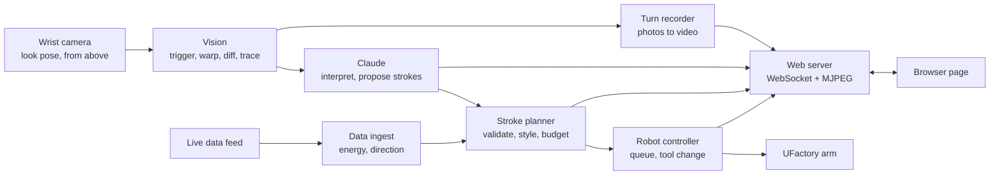
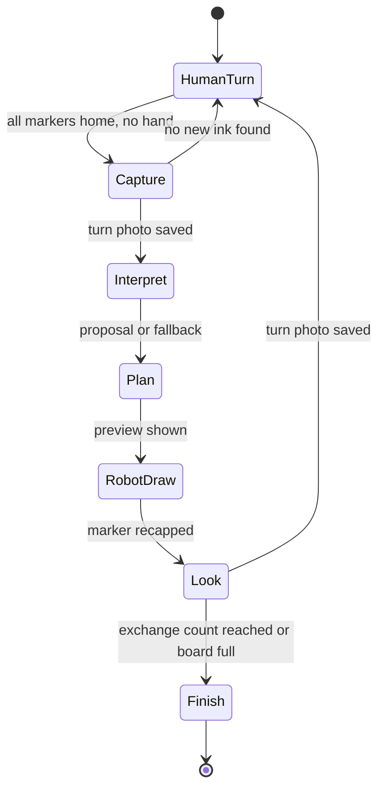

# PRD: Duet — a robot arm that draws with you

_As of 2026-09-18_

## Concept

Duet is a tabletop robot that looks at what a person has drawn, works out what the drawing is becoming, and adds to it. The two take turns on an 8.5 x 11 in dry erase board until the piece is done. The interesting part is the interpretation: every turn, a photo from above goes to Claude, which decides what to draw next.

Four things shape every piece:

- **You supply the seeds.** Each mark you draw is what the robot responds to.
- **Claude supplies the idea.** It says what it sees and what it will add, in one sentence the audience can read.
- **The artist supplies the style.** Van Gogh, Mondrian or Haring decides how that addition is drawn.
- **The length setting supplies the scale.** Short, Medium or Long sets how much the robot draws per turn.

The handoff is physical. The robot acts only after the visitor puts the marker back in its cap. A photo is taken after every turn, and the photos are stitched into a video of the drawing growing.

Live data is a later layer: a real-time feed can set how dense and directional the robot's strokes are.

## Goals and non-goals

The demo succeeds if a stranger can walk up, draw one mark and watch the robot answer it, with no explanation beyond the screen.

Goals:

- A five-exchange duet takes about 5 minutes on Short, 7 on Medium and 11 on Long. The screen's exchange counter always matches the board.
- The robot's addition makes sense for the drawing. A stranger who reads Claude's one-sentence interpretation agrees with it.
- Recapping the marker is the only handoff. No button is needed to pass the turn.
- Short, Medium and Long produce visibly different amounts of robot drawing.
- The three artist modes produce drawings a stranger can tell apart at a glance.
- Every session ends with a stitched video built from one photo per turn.
- Marker pick and recap succeeds at least 19 times in 20.

Non-goals:

- Reproducing actual artworks. Each mode borrows a stroke grammar, not a painting.
- Wet media, more than three robot colors, or a surface larger than 8.5 x 11.
- Simultaneous drawing. Human and robot never share the board at the same moment.
- Accounts or storage beyond a simple gallery of finished pieces.

## Physical setup

The rig is the spec: a UFactory xArm clamped to a white desk, a camera on its wrist, a framed dry erase board lying flat and a putty-filled container holding three markers. (The two rig photos this brief was written against are not in the repository; the turn photos in `site/demo/sessions` show the board from the wrist camera.)

| Item | Spec |
| --- | --- |
| Arm | UFactory xArm with the xArm Gripper, base plate held to the desk by C-clamps. Axis count to confirm (6 or 7). Its reach of about 700 mm covers the board and dock with room to spare. |
| Camera | The camera already mounted on the wrist (it looks like an Intel RealSense on UFactory's camera stand). All observation is from above: the arm moves to a fixed look pose over the table, and one frame covers both the board and the dock. Keep the dock within about 80 mm of the board so both fit. |
| Board | 8.5 x 11 in dry erase board with a raised white plastic frame, lying flat. The frame is a lip the marker tip must clear, so the drawable area starts about 15 mm inside it. Fix the board to the desk with mounting putty; any shift breaks calibration. |
| Robot markers | The three fine-tip dry erase markers in the dock: red, green, blue. The red and green barrels are already wrapped in masking tape for grip. Wrap the blue one too so all three grip alike. |
| Human marker | None of its own. The visitor takes any marker from the dock, draws, and returns it to its cap. That return is what hands the turn to the robot. New human ink is found by comparing turn photos, so it can be any color. |
| Marker dock | Clear food container packed with white putty, stuck to the desk on a mounting pad. Each marker stands tip-down in its cap. See Marker dock. |
| Registration | Four small tags or squares of dark tape at the board corners. A white board on a white desk gives the camera no edges to find otherwise. |
| Lighting | A fluorescent strip sits directly overhead and reflects off the board. Tilt the look pose 15 to 20 degrees off vertical so the reflection falls outside the frame; the homography removes the tilt. |
| Compute | One laptop runs robot control, vision and the web server. |

A three-corner touch-off with the marker tip maps the board to the robot. Touch off on the writing surface, inside the frame.

The look pose doubles as the park pose: about 350 to 400 mm above the board, high enough to leave room for a drawing hand.

## Artist modes

The recommended lineup is Van Gogh, Mondrian and Keith Haring: three periods a century apart, and three different stroke primitives (dashes, straight lines, outlines).

Claude chooses what to add; the artist mode decides how it is drawn. The table's grammar and answer columns are the styling rules, and they double as the fallback when the Claude call fails.

| Artist | Period | Stroke grammar | How it answers your mark | What live data changes |
| --- | --- | --- | --- | --- |
| Vincent van Gogh | Post-Impressionism, 1880s | Short curved dashes laid along a swirling flow field | Treats your mark as a rock in a current. Dashes stream around it and curl into spirals at its ends. | Direction bends the current. Energy sets dash length and density. |
| Piet Mondrian | De Stijl, 1920s | Straight horizontal and vertical lines, hatched rectangles | Snaps your mark's bounding box to a grid, extends its edges to the board edge in blue, then hatches one neighboring cell. | Energy sets how many subdivisions are added per turn. Direction picks which side grows. |
| Keith Haring | New York street art, 1980s | One bold continuous outline plus short radiating ticks | Draws an offset outline around your mark, then motion ticks radiating from it. Closed shapes may get a second, echoing figure. | Energy sets tick count and length. Direction tilts the ticks. |

All three work as pure line art, which is all a marker can do. Haring drew in marker and chalk, so his mode is the most faithful and the most legible from across a room.

The robot uses one color per turn, because a marker change costs about 15 s. Claude proposes the color and the artist's rule constrains it:

- **Van Gogh:** blue for swirls, green for anchoring shapes, red sparingly for accents.
- **Mondrian:** blue on line turns, red on fill turns. Green stays in the dock, since Mondrian avoided it.
- **Haring:** red for outlines, blue for ticks, green for echo figures.

The dock in the photos holds red, green and blue. Swapping green for black would make the Mondrian and Haring modes read truer.

Alternate: Hokusai (Edo Japan, 1830s), with long parallel contour lines and claw-tipped curls. Swap him in for Van Gogh if a surf cam becomes the data feed. The two overlap in style, so do not run both.

## Experience

Duet mode is the hero: a person and the robot alternate marks until the board is full. Solo mode runs the same system on live data alone, as an attract loop when nobody is at the table.

Duet mode:

1. The visitor picks an artist, a drawing length (Short, Medium or Long) and how many exchanges the piece runs for, from 3 to 10.
2. The screen says "Your turn." The visitor takes any marker from the dock and draws.
3. The visitor pushes the marker back into its cap. The camera sees all three markers home and no hand in frame. That is the only trigger; there is no button.
4. The camera takes the turn photo and sends it to Claude. The screen shows Claude's reply, such as "I see a fish. Adding bubbles and a waterline." This is the "it understands me" moment.
5. The site previews the planned strokes. The arm picks a marker and draws them, within the length setting's budget.
6. The arm recaps the marker, returns to the look pose and takes the robot's turn photo. The screen returns to "Your turn."
7. After the visitor's chosen number of exchanges, or when ink covers about a third of the board, the robot signs a small mark in the corner. The site stitches the turn photos into a video and saves it with the final photo and the SVG.
8. The visitor wipes the board.

The length setting scales each robot turn; the exchange count sets how many turns there are. Both can change between turns, and the screen always shows where the piece stands, as "Exchange 2 of 5."

| Setting | Robot turn | Path budget | What Claude is asked for |
| --- | --- | --- | --- |
| Short | about 15 s | 400 mm | One small addition: a detail or an accent |
| Medium | about 40 s | 1,200 mm | One full element that extends the drawing |
| Long | about 90 s | 3,000 mm | Several elements: a setting or a second subject |

Solo mode: each turn, the planner takes the strongest feature in the live data as the "mark" and answers it in the chosen artist's grammar. No human input is needed.

Remote play (stretch): site visitors draw a mark on an on-screen canvas. Marks join a queue; the robot draws each one in green, then answers it in another color.

## System architecture

One Python process on the laptop does everything: it reads the camera, routes each turn photo through Claude, plans strokes, drives the arm, records the session and serves the web page.

Every turn photo takes two paths: to Claude, which proposes what to draw, and to the recorder, which keeps it for the video. The planner turns the proposal into safe, styled strokes for the arm.

- **Stack:** FastAPI, OpenCV, shapely (offsets and clearance checks), scikit-image (skeletonize), ffmpeg, the xArm Python SDK and the Anthropic SDK for Claude.
- **One coordinate system:** all geometry is in board millimeters, origin at the board's top-left. Only two transforms exist: camera pixels to board (corner-tag homography) and board to robot base (touch-off).
- **Claude proposes, the planner disposes:** Claude never drives the arm. It returns strokes as data; the planner validates, trims and styles them. See Turn loop.
- **The planner is a pure function:** proposed strokes, existing ink, artist, length setting, energy and direction go in; a list of polylines and one color come out. It can be built and tested in the browser before the arm moves.
- **The controller owns the arm:** it consumes a stroke queue, runs tool changes, moves to the look pose for every capture and emits progress events. Nothing else talks to the robot.
- **Data feed (P1):** Open-Meteo wind speed and bearing at the venue, polled every 60 s, no API key. Energy is wind speed scaled to 0–1 against 40 km/h; direction is the bearing.

## Web app spec

The site is a single HTML page with no framework: panels stack vertically on a phone and sit in a grid on a laptop.

| Panel | Shows | Priority |
| --- | --- | --- |
| Live camera | MJPEG stream from the wrist camera in an image tag: the board and dock from above during the human's turn, a moving pen-cam view while the robot draws. Planned strokes are overlaid while the arm is at the look pose. | P0 |
| Interpretation | Claude's sentence for this turn: what it sees and what it will add. Shown before the arm moves. | P0 |
| Exchange counter | Where the piece stands: a large "2 of 5" beside the screenshot from the last completed turn. The number is the visitor's chosen count and is editable mid-session. | P0 |
| Vector plan | SVG of every stroke: traced human marks, drawn robot strokes solid in their marker color, queued strokes dashed and animating as the arm progresses | P0 |
| Controls | Artist picker, Short / Medium / Long length setting, exchange count (3 to 10), Duet or Solo toggle, Pause. There is no Done button: recapping the marker passes the turn. | P0 |
| Session video | The stitched video of the turn photos, playable and downloadable when a session ends | P0 |
| Live data | Animated particle field driven by the feed, plus the two numbers it produces: energy (0–1) and direction (degrees) | P1 |
| Gallery | Video, final photo and SVG for each finished piece | P1 |

One WebSocket carries all state. Message types: `state` (turn, artist, length, exchange n of N, mode), `dock` (which markers are home), `human` (traced polylines), `interpretation` (Claude's two sentences), `plan` (polylines and color), `progress` (current stroke index), `video` (link when stitched), `shot` (the latest turn screenshot) and `data` (energy, direction).

For public viewing, expose the laptop through a tunnel. Viewers get the page read-only; the controls require a token in the URL.

## Turn loop

The loop is strictly turn-based and the trigger is physical: the robot acts only once every marker is back in its cap and no hand is in frame. Each turn then runs photo, Claude, plan, draw, photo.

A photo is saved in Capture and again in Look, so every turn, human or robot, leaves one frame for the video.

### The trigger

From above, each docked marker shows as a colored dot, its end plug, on white putty at a known spot. A missing dot means a marker is in someone's hand. The human's turn ends when all of these hold:

- At least one dot went missing and all three are back within 3 mm of their recorded positions.
- The frame has been still for 1.5 s.
- No hand-sized blob is visible over the board or the dock.

If a dot is back but out of position, or in the wrong slot, the screen asks the visitor to reseat the marker, since the robot could not pick it up.

### Reading the turn

Classical vision runs first and gives Claude exact coordinates to work from.

1. Grab 5 frames from the look pose and take the median to remove noise.
2. Warp to a flat, top-down board image using the corner tags. Save it as this turn's photo.
3. Subtract the previous turn photo and threshold. What remains is the human's new ink, whatever color they chose.
4. Skeletonize, trace to polylines and simplify (Ramer–Douglas–Peucker, 0.5 mm tolerance).

### Routing through Claude

Every turn goes through Claude; this is P0, not an add-on. The call runs through the Anthropic Messages API with the board photo as a base64 image block.

- **Sent:** the flat board photo with a millimeter grid drawn along its edges, the traced coordinates of the new human strokes, the turn history (what Claude said and drew before), the artist, the available colors, the length setting with its path budget, and which exchange this is out of the total the visitor set, so Claude can pace itself and close the piece on the last turn.
- **Returned, as raw JSON with no prose or code fences and parsed defensively:** `sees` (one sentence on what the drawing is now), `adds` (one sentence on what it will add and why), `color`, and `strokes`, a list of polylines, circles and arcs in board millimeters.
- **Validated:** strokes are clipped to the drawable area, trimmed to the path budget, and kept 3 mm clear of existing ink unless Claude marks a stroke as attached to it.
- **Styled:** the artist mode redraws the validated strokes in its grammar: dashes for Van Gogh, orthogonal snaps for Mondrian, a bold outline plus ticks for Haring.
- **Fallback:** if the call fails, returns unparseable JSON or takes over 8 s, the planner answers from the traced geometry with the artist grammar alone, and the screen says so.

The `sees` and `adds` sentences go to the screen before the arm moves. Strokes are ordered so the first ones land next to the human's mark. The hand check runs again immediately before any arm motion.

### Turn photos and video

The flat, top-down photo saved after every turn is the same frame vision uses, so recording costs nothing extra. Photos are named by session and turn number, and the latest one is the screenshot shown beside the exchange counter. When a session ends, ffmpeg stitches them into an MP4: about 1 s per turn and a 2 s hold on the final frame. P1 burns Claude's `sees` and `adds` sentences in as captions, so the video tells the story on its own.

## Marker dock

The dock is the clear container of white putty in the photo: each marker's cap is buried in the putty and the marker stands tip-down in it. The tip never dries, the pick pose never changes, and the marker is already pointing the way it draws.

Visitors share these same three markers, which is settled: no fourth cap, and no marker of the visitor's own. Pushing a marker back into its cap is how a visitor says "your turn," so each cap must sit firmly enough for a one-handed push. Before each pick, the robot corrects its target to the dot position seen from above, which absorbs small shifts from human handling.

Pick:

1. Move above the slot at safe height with the gripper open.
2. Descend to grip height on the barrel and close.
3. Pull straight up 40 mm at low speed to uncap.
4. Move to the board.

Return:

1. Move above the slot.
2. Descend slowly until the tip seats in the cap, then press to the taught height.
3. Open the gripper and rise.

Build notes:

- **Let the arm plant the markers.** Grip each marker with the gripper pointing straight down, press its cap into the putty, record the pose, then release. The slot is then exactly where the robot thinks it is, and vertical. The red and green markers lean in the photo, which would make recapping miss.
- **Weigh the dock down.** The container is light, so the uncapping pull can lift the whole thing. Put weight under the putty, such as a stack of coins or washers, or tape the rim to the desk.
- **Open the gripper only part way.** The markers stand about 25 to 30 mm apart, closer than the gripper's full opening. Set them in a straight row, approach with the fingers closing across the row, and open about 15 mm wider than the barrel. The xArm Gripper is position-controlled, so this is one SDK call.
- **Turn each tape wrap into a collar.** Build the masking tape up until it rests on top of the fingers. The marker then cannot slide up in the grip and change the tip height.
- **Match the fingertips.** The two fingertip faces look different in the photo; one carries a gray pad. Make both the same so the marker centers between them.
- **Mind the camera cable.** Approach the dock from the side away from the wrist camera, so the camera and its looped USB cable stay clear of the neighboring markers.
- One color per turn means one pick and one return per exchange.

## Risks and mitigations

The two risks that can end the demo are a hand on the board while the arm moves and a marker dock that fails mid-duet. Both get tested before anything else is built.

| Risk | Mitigation |
| --- | --- |
| A hand is on the board when the arm moves | The marker-home trigger, a hand-blob check immediately before motion, speed capped near 100 mm/s, collision sensitivity at maximum, E-stop within the operator's reach |
| The visitor returns a marker crooked, loose or to the wrong cap | Dot position and color checked from above; the screen asks for a reseat; pick target corrected from the camera |
| Claude is slow, unreachable or returns bad JSON | 8 s timeout, then the artist grammar answers from the traced geometry; the screen says which path was used |
| Claude misreads the drawing | Its `sees` sentence is on screen, so a wrong read is legible and often funny rather than a silent failure; turn history keeps later turns consistent |
| Claude places strokes in the wrong spot | Millimeter grid on the photo, traced coordinates in the prompt, validation against existing ink, on-screen preview before the arm moves |
| The uncapping pull lifts a cap or the whole putty container | Weight in the container and its rim taped to the desk; a 20-cycle pick and return test comes first |
| The marker slips in the gripper and tip height drifts | Tape collar on each barrel; tip height re-checked by touch-off whenever a marker is reseated |
| The overhead strip light glares on the board | Look pose tilted so the reflection falls out of frame, median of 5 frames |
| The wrist camera moves with the arm | Vision and turn photos only from the recorded look pose; mid-stroke frames are for streaming only |
| The board shifts on the desk | Mounting putty under the board; corner tags re-checked every turn, with a warning on screen if they move more than 1 mm |
| The marker tip catches the board's raised frame | Drawable area inset 15 mm; travel moves lift 20 mm |
| Dry erase ink smears under the human's hand | Each turn is compared with the previous turn photo, so old smears never read as new marks |
| Venue wifi drops | The Claude call needs the network, so tether a phone as backup; the fallback grammar keeps the loop running offline |
| A Long turn is dull to watch | Plan preview and Claude's sentence on screen first; first strokes land next to the human's mark; pen-cam stream while drawing |
| The small board fills up fast | Fine-tip markers; the coverage check ends the session early whatever the visitor set, and high counts are nudged toward Short |

## Build plan

Build in this order and stop at any cut line with a working demo. P0 alone is a complete duet with one artist.

P0, the demo exists:

- [ ] Arm draws a hard-coded square on the board with one marker (touch-off calibration, board fixed with putty)
- [ ] Dock: pick, uncap, recap and return for all three slots, 20 cycles without a miss
- [ ] Look pose that frames the board and the dock from above; corner tags, warp, turn photo saved to disk
- [ ] Marker-home trigger: three dots present, still frame, no hand
- [ ] Diff against the previous turn photo and trace the human's new ink
- [ ] Claude call: photo and coordinates in, JSON strokes out, validated and previewed in the browser. No robot needed to test this.
- [ ] Short, Medium and Long budgets and the exchange count wired into the prompt, the validator and the counter panel
- [ ] One artist styler. Haring first: bold outline plus ticks is the shortest code.
- [ ] Browser page: stream, interpretation sentence, plan preview, controls, exchange counter with the last turn's screenshot
- [ ] Wire the loop: markers home, capture, interpret, plan, draw, look
- [ ] ffmpeg stitch of the turn photos into a video at session end

P1, the full concept:

- [ ] Mondrian and Van Gogh stylers
- [ ] Captions from Claude burned into the video
- [ ] Live data ingest to energy and direction, plus the particle panel
- [ ] Solo mode attract loop
- [ ] Signature and gallery
- [ ] Public tunnel with read-only viewers

P2, stretch:

- [ ] Remote players drawing from the site
- [ ] A fourth dock slot with an eraser, so the robot wipes the board itself

## Open questions

The shared markers, Claude as the vision model and a user-set exchange count are settled. What remains is hardware confirmation and one model choice.

- [x] **Surface.** Confirmed from the photos: a framed 8.5 x 11 dry erase board.
- [ ] **Arm and camera.** The photos show an xArm with the xArm Gripper and a wrist camera. Still to confirm: 6 or 7 axes, and the camera model, which sets the capture code.
- [x] **Hero.** Settled: the robot interpreting the drawing and adding to it is the point, and live data stays a P1 modifier.
- [ ] **Artist lineup.** Van Gogh, Mondrian and Haring as proposed, or Hokusai in place of Van Gogh if a surf cam is the feed?
- [ ] **Build window.** How many hours are there? This sets where the cut line falls.
- [ ] **Audience.** Does the site need to be public during the demo, or is a local screen enough?
- [ ] **Green or black.** The dock holds red, green and blue. Swapping green for black would make the Mondrian and Haring modes read truer.
- [ ] **Claude model tier.** Sonnet for speed or Opus for better composition, tested on the same ten board photos against the 8 s budget.
